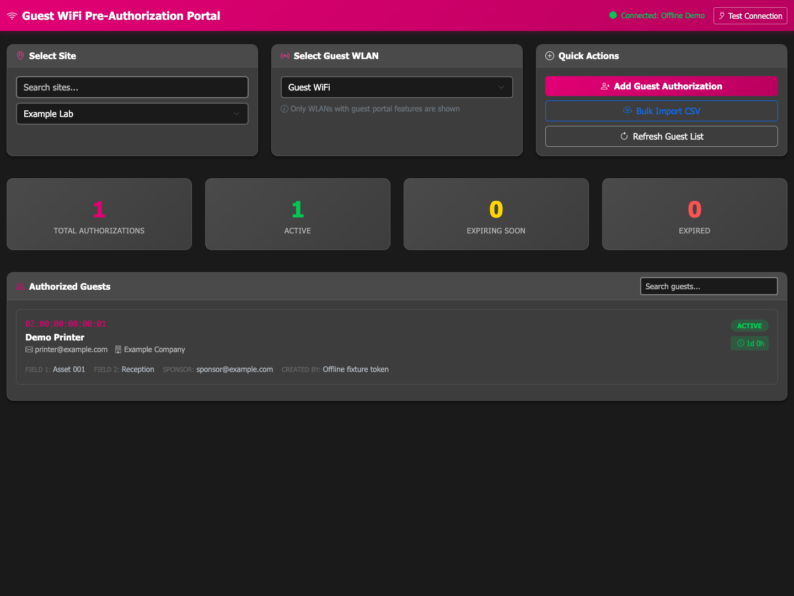
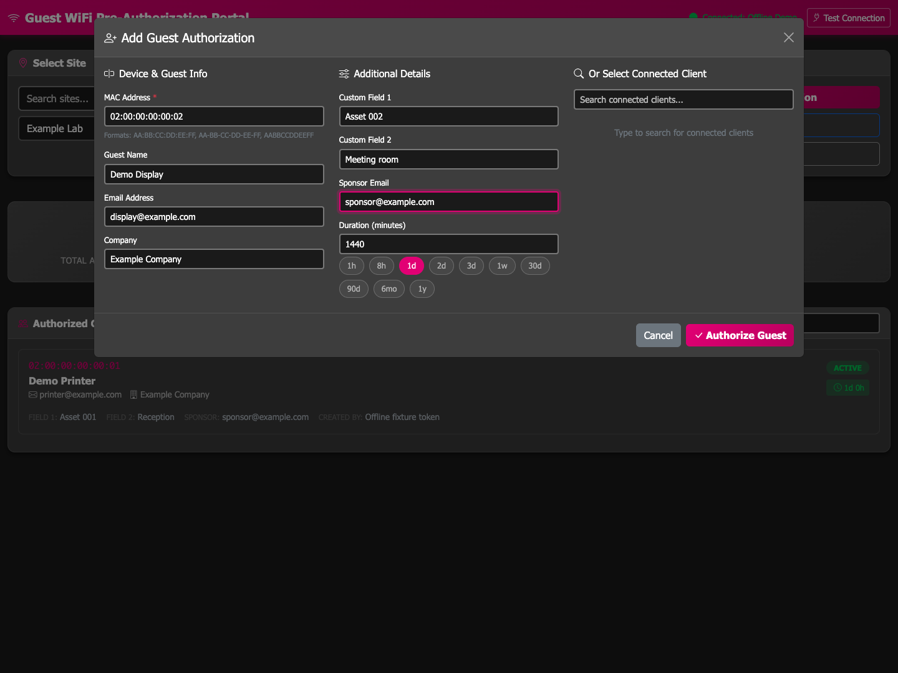
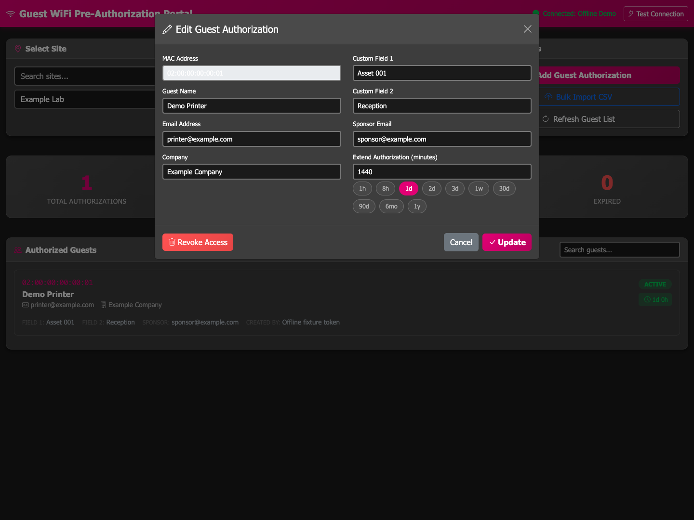
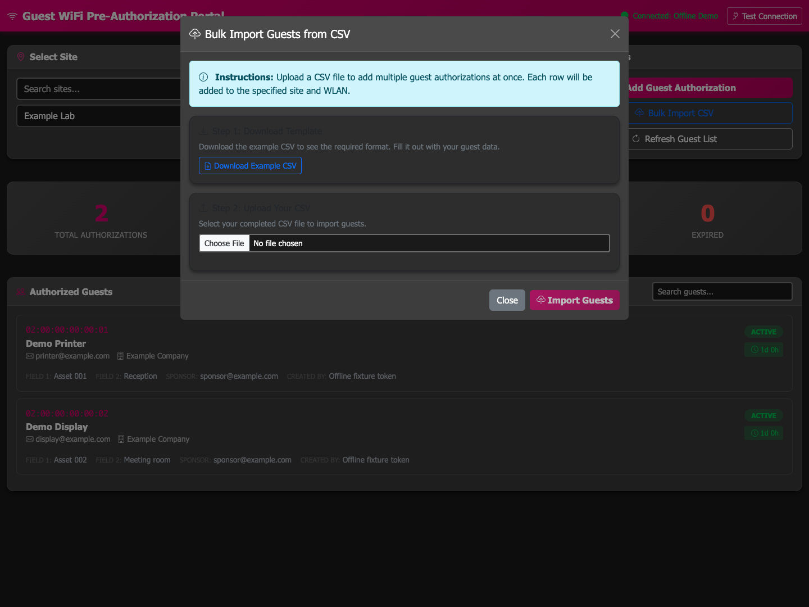

# MistGuestAuthorizations

## What

A web portal that manages Juniper Mist guest WiFi device access. Add, edit,
extend, revoke, or bulk-import MAC address authorizations. Select a site and
guest WLAN, search connected clients, and view access status.

The real dashboard below uses fictional offline data, not a live Mist account.



## How

Use Python 3.13 or later. From the repository root, create an environment and
install the runtime dependencies:

```sh
python3.13 -m venv .venv
. .venv/bin/activate
python -m pip install -r requirements.txt
cp .env.example .env
```

Set `MIST_APITOKEN` in `.env`, then start the portal:

```sh
python app.py
```

Open `http://localhost:5000` in your browser. For Windows activation, container
deployment, and detailed setup, follow the
[setup and deployment guide](docs/guide.md#quick-start). See
[configuration](docs/guide.md#configuration) and
[user instructions](docs/guide.md#usage) before you grant device access.

These captures show the actual add, edit, and CSV import screens with
fictional data. [Capture details and reproduction](docs/screenshots/README.md)
explain how to run them without a Mist API call.

| Add a guest | Edit a guest | Import guests |
|---|---|---|
|  |  |  |

## Where

Run the portal on a local host or in a container with access to your Mist cloud.
The default local address is `http://localhost:5000`.
See the [deployment guide](docs/guide.md#docker-deployment) for the published
container image and the [API reference](docs/guide.md#mist-api-endpoints-used)
for the Mist endpoints.

Source and issue tracking:
[jmorrison-juniper/MistGuestAuthorizations](https://github.com/jmorrison-juniper/MistGuestAuthorizations).

## When

Use this portal when a device needs guest WiFi access but cannot complete a
captive portal form. Set the access duration before you grant access. Review
expired entries and revoke access when it is no longer needed.
See [troubleshooting](docs/guide.md#troubleshooting) if access fails.

## Why

Printers, displays, and other headless devices cannot sign in with a browser.
MAC address pre-authorization lets these devices use a guest WLAN without an
interactive sign-in. The portal puts these tasks in one interface; Mist remains
the service that grants network access.

## Who

For operators who manage guest WiFi and have a Mist API token with the
[required permissions](docs/guide.md#required-api-permissions).
Joseph Morrison maintains this project.
See [contribution guidance](docs/guide.md#contributing),
[offline tests and quality gates](docs/development.md), and the
[CC BY-NC-SA 4.0 license](LICENSE).
